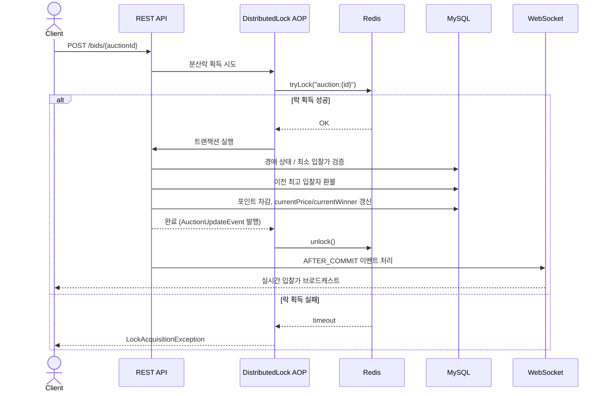
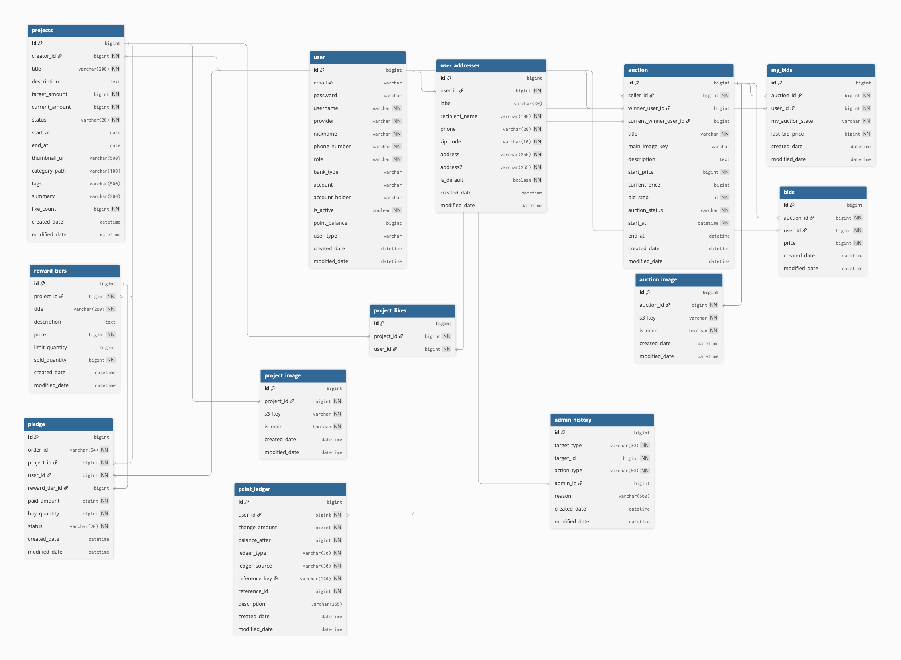

# ddip

경매(Auction)와 크라우드펀딩(공동구매)을 결합한 커머스 플랫폼

## 담당 파트

| 영역 | 구현 내용 |
|---|---|
| 경매(Auction) 도메인 | 입찰, 낙찰, 상태 전이(`RUNNING`/`ENDED`/`CANCELED`) 전체 로직 설계 및 구현 |
| 동시성 제어 | AOP 기반 커스텀 `@DistributedLock`으로 Redisson 분산락 구현, 동시 입찰 시 레이스 컨디션 방지 |
| 검색 | Elasticsearch에 Nori 형태소 분석기 + n-gram analyzer 적용, 한글 키워드/부분 검색 구현 |
| 실시간 알림 | 입찰 이벤트 발행 후 WebSocket(STOMP)으로 최신 입찰가 브로드캐스트 |
| 배포 | Jenkins CI/CD 파이프라인 구축, GitHub push부터 서버 배포까지 자동화 |

## 경매 입찰 흐름

**패키지 구조** (`backend/src/main/java/com/ddip/backend`)

| 패키지 | 역할 |
|---|---|
| `auction` | 경매 도메인 — 입찰/낙찰/상태 전이 |
| `project` | 크라우드펀딩(공동구매) 도메인 |
| `pledge` | 공동구매 참여(펀딩) |
| `billing` | 포인트/결제 |
| `user` | 회원/인증 |
| `notification` | 알림 |
| `recommendation` | 추천 |
| `admin` | 관리자 기능 |
| `common` | 공통 설정, AOP, 이벤트 핸들러 |

## 기술 스택

| 구분 | 기술 |
|---|---|
| Backend | Java 21, Spring Boot, Spring Data JPA, QueryDSL |
| DB | MySQL, Redis |
| 검색 | Elasticsearch |
| 실시간 통신 | WebSocket |
| 인증 | Spring Security, OAuth2 Client, JWT |
| 인프라 | AWS EC2 |
| CI/CD | Jenkins, Docker, Docker Compose |

## ERD

## CI/CD

GitHub push → Jenkins 빌드 → Docker Hub push → Production 서버 배포까지 자동화되어 있습니다.

| Stage | 내용 |
|---|---|
| Checkout | GitHub 저장소 체크아웃 |
| Docker Login | Docker Hub 로그인 |
| Build & Push | 백엔드/Elasticsearch 이미지 빌드 후 Docker Hub push |
| Deploy | `docker-compose.yml`을 배포 서버로 scp, SSH로 배포 스크립트 실행 |
| Cleanup | 로그아웃 및 빌드 캐시/이미지 정리 |
